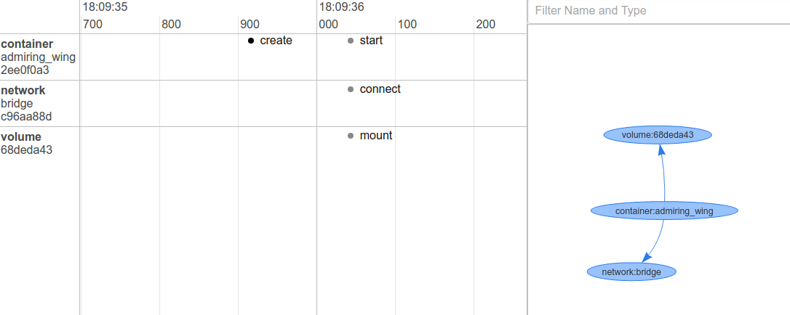
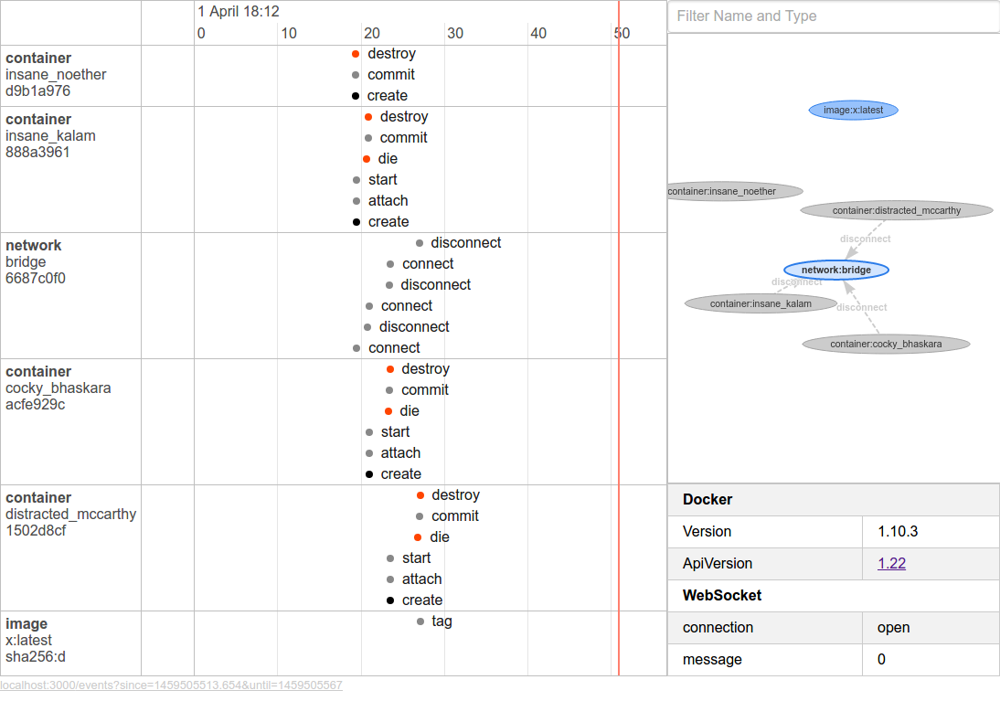
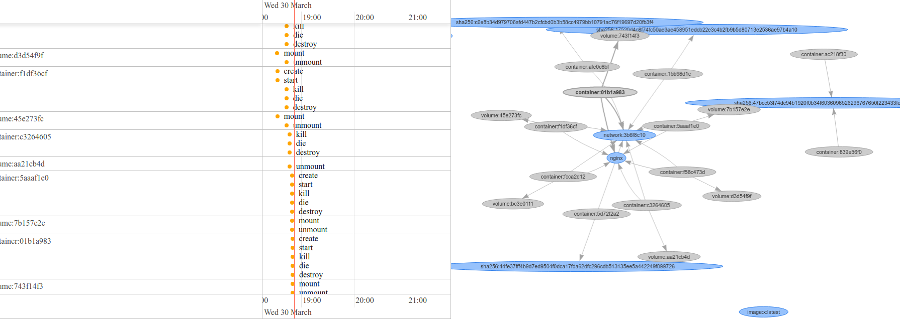

# vis-docker
[]()

A realtime visualization of Docker events using [vis.js](http://visjs.org/)

# How to run it ?

**Run in docker environment**

```sh
docker run -v /var/run/docker.sock:/var/run/docker.sock:ro -p 9587:3000 -d wyvernnot/vis-docker
```

**Open Browser**

```
http://127.0.0.1:9587
```

# Screenshots

### Start an nginx server

```sh
docker run -d -P nginx
```



### Build a image

```
docker build --rm -t=x --no-cache ./example
```




### And More



# Development

```sh
git clone git@github.com:wyvernnot/vis-docker.git
cd vis-docker
npm install
npm start
```

# License

MIT